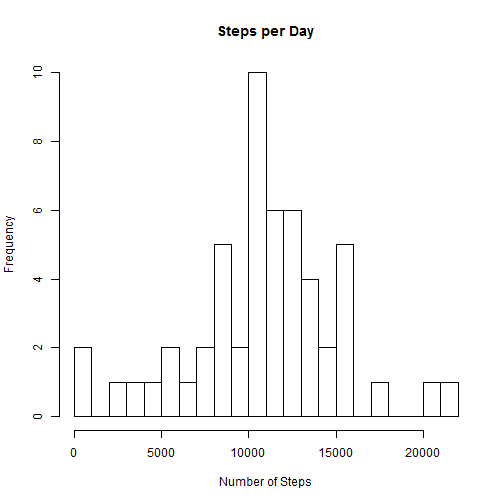
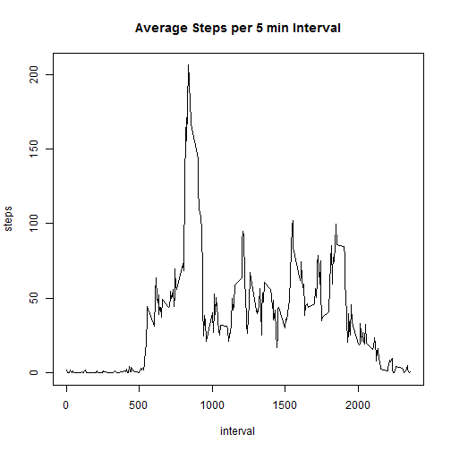
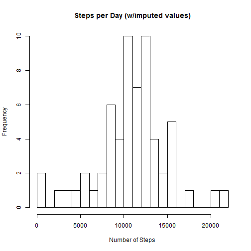
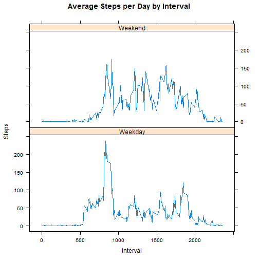

### About

This is the first assignment in the Reproducible Research class. The purpose is to answer a set of questions about a data set collected from an activity monitoring device such as a Fitbit, Nike Fuelband or Jawbone Up.

### Download and import research data

```r
temp <- tempfile()
download.file('https://d396qusza40orc.cloudfront.net/repdata%2Fdata%2Factivity.zip',temp)
StepsData <- read.delim(unzip(temp),sep = ',')
unlink(temp)
library(data.table)
```
  

### Questions
#### What is mean total number of steps taken per day?
>**Calculation of total steps per day and histogram of the resulting values.**
>
>```r
>StepsbyDate <- aggregate(steps ~ date, StepsData, sum)
>hist(StepsbyDate$steps, breaks = 30, main = 'Steps per Day', xlab = 'Number of Steps')
>```
>
>
>
>**Determination of the mean and median steps taken per day.**
>
>```r
>meansteps <- mean(StepsbyDate$steps)
>mediansteps <- median(StepsbyDate$steps)
>```
> The mean is `10766.19` and the median is `10765`.
  
#### What is the average daily activity pattern?
>**Determine average steps per 5 minute interval and plot the results.**
>
>```r
># Total steps per interval
>StepsbyInterval <- aggregate(steps ~ interval, StepsData, sum)
>
># Days with values for each interval
>CompleteIntervals <- StepsData[complete.cases(StepsData),]
>CountsbyInterval <- as.data.frame(table(CompleteIntervals$interval))
>colnames(CountsbyInterval) = c('interval', 'datecount')
>
># Merge step count totals with count of days
>AvgStepsbyInterval <- merge(StepsbyInterval, CountsbyInterval)
>AvgStepsbyInterval$AvgSteps <- with(AvgStepsbyInterval, steps / datecount)
>
># Plot the average steps per interval
>plot(AvgStepsbyInterval$interval, AvgStepsbyInterval$AvgSteps, type = 'l',
>     ylab = 'steps', xlab = 'interval', main = 'Average Steps per 5 min Interval')
>```
>
>
>
>**Determination of the interval which averages the most steps.**
>
>```r
>maxsteps <- StepsbyInterval[which.max(StepsbyInterval[,2]),1]
>```
> The interval with the most steps on average is `835`.
  
  
#### Imputing missing values
> How many values are missing from the data set?
>
>```r
>incomplete <- sum(!complete.cases(StepsData))
>```
>
> There are `2304` values missing from the data set.
>  
> We could assume that the average values by interval determined above would be acceptable for imputing each missing value. However, is there a variance based on day of the week which should be considered? By using the ```weekdays``` and ```mean``` functions on the totals by day, we can see if there are large differences for each day of the week. The able below summarizes that data as well a the number of missing values by day of the week.
>
>Day  | Avg Step Count| Missing Values  
---------- | ---------- | ---------- 
Sunday    | `12277.71`| `305`        
Monday        | `9974.857` | `301`               
Tuesday        | `8949.556`| `390`                
Wednesday        | `11790.75`        | `347`        
Thursday        | `8212.75`        | `349`        
Friday        | `12359.71` | `306`               
Saturday        | `12535.43`        | `306`        
>  
> Based on these values we should impute values based on day of the weeks as well as the interval.
>
>```r
>StepsData <- data.table(StepsData)
>AvgforImputing <- StepsData[,list(
>        SunAvg = mean(steps[weekdays(as.Date(date))=='Sunday'], na.rm = T),
>        MonAvg = mean(steps[weekdays(as.Date(date))=='Monday'], na.rm = T),
>        TueAvg = mean(steps[weekdays(as.Date(date))=='Tuesday'], na.rm = T),
>        WedAvg = mean(steps[weekdays(as.Date(date))=='Wednesday'], na.rm = T),
>        ThuAvg = mean(steps[weekdays(as.Date(date))=='Thursday'], na.rm = T),
>        FriAvg = mean(steps[weekdays(as.Date(date))=='Friday'], na.rm = T), 
>        SatAvg = mean(steps[weekdays(as.Date(date))=='Saturday'], na.rm = T)), 
>        by = c('interval')]
>StepsData_i <- merge(StepsData, AvgforImputing, 'interval')
>StepsData_i$steps <- with(StepsData_i, 
>        ifelse(weekdays(as.Date(date))=='Sunday' & is.na(steps), SunAvg,
>        ifelse(weekdays(as.Date(date))=='Monday' & is.na(steps), MonAvg,
>        ifelse(weekdays(as.Date(date))=='Tuesday' & is.na(steps), TueAvg,
>        ifelse(weekdays(as.Date(date))=='Wednesday' & is.na(steps), WedAvg,
>        ifelse(weekdays(as.Date(date))=='Thursday' & is.na(steps), ThuAvg,
>        ifelse(weekdays(as.Date(date))=='Friday' & is.na(steps), FriAvg,
>        ifelse(weekdays(as.Date(date))=='Saturday' & is.na(steps), SatAvg, 
>        steps))))))))
>StepsData_i <- StepsData_i[,c(3,1:2)]
>```
>  
> **How does the imputed data impact the distribution of steps by day as well as the mean and median values?**
>
>```r
>StepsbyDate_i <- aggregate(steps ~ date, StepsData_i, sum)
>hist(StepsbyDate_i$steps, breaks = 30, main = 'Steps per Day (w/imputed values)', xlab = 'Number of Steps')
>```
>
>
>  
> The number of days with 9,000 & 12,000 steps have each increased by 1 while the number of days with 13,000 steps has increased by 4 to tie the number of days with 11,000 steps at 10 days each.
>
> **Determination of the new mean and median steps taken per day.**
>
>```r
>meansteps_i <- mean(StepsbyDate_i$steps)
>mediansteps_i <- median(StepsbyDate_i$steps)
>```
> With the imputed missing values, the mean is `10821.21` and the median is `11015`. These values represent increases of `55.02092` for the mean and `250` for the median.
  
#### Are there differences in activity patterns between weekdays and weekends?
> A factor variable can be introduced to identify which days are weekends and which are weekdays.
>
>```r
>WEDays <- c('Saturday', 'Sunday')
>StepsData_i$DoW = as.factor(ifelse(is.element(weekdays(as.Date(StepsData_i$date))
>        ,WEDays), "Weekend", "Weekday"))
>StepsbyInterval_i <- aggregate(steps ~ interval + DoW, StepsData_i, mean)
>```
>  
> With the factor variable in place, we can now graph the data to compare weekdays to weekend.
>
>```r
>library(lattice)
>xyplot(StepsbyInterval_i$steps ~ StepsbyInterval_i$interval | StepsbyInterval_i$DoW, 
>       main="Average Steps per Day by Interval", xlab = "Interval", ylab = "Steps", 
>       layout = c(1, 2), type = "l")
>```
>
>
>  
> Utilizing this pair of plots, we see that while the peak is higher on week days, the sustained average number of steps for each interval is higher on weekends.
